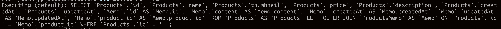

week2-1

===

## 비동기

- 작업을 대기 해야하는 경우에 해당 작업과 코드 진행이 동시에 진행이 됩니다. 이때 대기하는 작업을 기다리는것을 비동기라고 합니다.

### Promise

- 해당 작업이 완료되면 resolve, 실패하면 reject로 반환합니다.
- 완료된 데이터를 반환하며, Then으로 받아와야 합니다.
- 3개의 상태값이 있습니다.
  - pending : 비동기 코드가 아직 처리되지 않은상태
  - Fulfilled : 비동기가 처리완료되어 반환이 되어진상태.
  - Rejected : 비동기 처리가 실패하였을 경우

```js
const p1 = new Promise((resolve, reject) => {
  setTimeout(() => {
    resolve({ p1: 'hello' });
  }, 500);
});

console.log(p1);
const p2 = p1;
console.log(p2);
```

결과값

```
Promise { <pending> }
Promise { <pending> }
```

- Promise를 반환한 값을 사용하기 위하여 then을 이용하여 해당 값을 반환시켜 주어야 합니다. then의 Parameter는 비동기가 완료된 값을 받아서 사용할 수 있습니다.

```js
const p1 = new Promise((resolve, reject) => {
  setTimeout(() => {
    resolve({ p1: 'hello' });
  }, 500);
}).then((result) => {
  console.log(result.p1);
});
const p2 = new Promise((resolve, reject) => {
  setTimeout(() => {
    resolve({ p2: 'bye' });
  }, 1000);
}).then((result) => {
  console.log(result.p2);
});
```

결과값

```
hello //0.5초후 실행
bye //1초후 실행
```

- Promise Chaining
  - 프로미스를 엮어 프로미스를 진행할 수 있습니다.
  - 프로미스를 순차적으로 실행하며, 다른 프로미스를 호출해주려면 프로미스 값을 리턴해주면 됩니다.

```js
const p1 = new Promise((resolve, reject) => {
  setTimeout(() => {
    resolve({ p1: 'hello' });
  }, 500);
});
const p2 = new Promise((resolve, reject) => {
  setTimeout(() => {
    resolve({ p2: 'bye' });
  }, 1000);
});

p1.then((result) => {
  console.log(`p1 = ${result.p1}`);
  return p2;
}).then((result) => {
  console.log(`p2 = ${result.p2}`);
});
```

결과값

```
p1 = hello //0.5초후 실행
p2 = bye //1.5초후 실행
```

- Promise.all
  - 반환하는 데이터에는 return값들이 배열로 들어갑니다.
  - 넣는 프로미스중 가장 큰값을 기준으로 실행이 됩니다.

```js
const p1 = new Promise((resolve, reject) => {
  setTimeout(() => {
    resolve({ p1: 'hello' });
  }, 500);
});
const p2 = new Promise((resolve, reject) => {
  setTimeout(() => {
    resolve({ p2: 'bye' });
  }, 1000);
});
Promise.all([p1, p2]).then((result) => {
  console.log(result);
  console.log(`p1 = ${result[0].p1}`);
  console.log(`p2 = ${result[1].p2}`);
});
```

결과값

```
[ { p1: 'hello' }, { p2: 'bye' } ]//1초후 실행
p1 = hello //1초후 실행
p2 = bye//1초후 실행
```

Promise.chaining을 사용할 경우

```js
const p1 = new Promise((resolve, reject) => {
  setTimeout(() => {
    resolve({ p1: 'hello' });
  }, 500);
});
const p2 = new Promise((resolve, reject) => {
  setTimeout(() => {
    reject('error입니다');
  }, 1000);
});

p1.then((result) => {
  console.log(`p1 = ${result.p1}`);
  return p2;
}).then((result) => {
  console.log(`p2 = ${result.p2}`);
});
```

결과값

```
p1 = hello
(node:9930) UnhandledPromiseRejectionWarning: error입니다
```

Promise.all을 사용할 경우

- reject메세지는 catch로 잡을 수 있습니다.

```js
const p1 = new Promise((resolve, reject) => {
  setTimeout(() => {
    reject('error입니다');
  }, 500);
});
const p2 = new Promise((resolve, reject) => {
  setTimeout(() => {
    resolve({ p2: 'bye' });
  }, 1000);
});
Promise.all([p1, p2])
  .then((result) => {
    console.log(result);
    console.log(`p1 = ${result[0].p1}`);
    console.log(`p2 = ${result[1].p2}`);
  })
  .catch((err) => {
    console.log(err);
  });
```

결과값

```
error입니다
```

### async await

- promise처럼 비동기를 사용하기 위해서 사용합니다.
- 순차적으로 진행하여 직관적입니다.
- 함수가 실행되고 난 후의 시간 기준으로 진행 됩니다.

```js
const p1 = new Promise((resolve, reject) => {
  setTimeout(() => {
    resolve({ p1: 'hello' });
  }, 500);
});
const p2 = new Promise((resolve, reject) => {
  setTimeout(() => {
    resolve({ p2: 'bye' });
  }, 1000);
});

const consoleP = async () => {
  const a = await p1;
  console.log(a);
  const b = await p2;
  console.log(b);
};

consoleP();
```

결과값

```
{ p1: 'hello' } //0.5초후 실행
{ p2: 'bye' } //1초후 실행
```

- err를 promise처럼 출력할 수 있습니다.
- 순차적으로 실행하기 때문에 성공적으로 작업된 값은 출력이 됩니다.

```js
const p1 = new Promise((resolve, reject) => {
  setTimeout(() => {
    resolve({ p1: 'hello' });
  }, 500);
});
const p2 = new Promise((resolve, reject) => {
  setTimeout(() => {
    reject('error code: ~~~~');
  }, 1000);
});

const consoleP = async () => {
  try {
    const a = await p1;
    console.log(a);
    const b = await p2;
    console.log(b);
  } catch (err) {
    console.log(err);
  }
};

consoleP();
```

결과값

```
{ p1: 'hello' }
error code: ~~~~
```

### async await와 Promise의 직관성 차이.

프로미스 실행

- 프로미스는 비동기 처리코드가 아닌 일반적인 코드를 작성하면 비동기로 실행되지 않습니다.

```js
//promise.js
const p1 = new Promise((resolve, reject) => {
  setTimeout(() => {
    resolve({ p1: 'hello' });
  }, 500);
});
const p2 = new Promise((resolve, reject) => {
  console.log('hello'); //사이에 값을 추가하였습니다.
  setTimeout(() => {
    resolve({ p2: 'bye' });
  }, 1000);
});
p1.then((result) => {
  console.log(`p1 = ${result.p1}`);
  return p2;
}).then((result) => {
  console.log(`p2 = ${result.p2}`);
});
```

결과값

```
hello
p1 = hello
p2 = bye
```

async 실행

```js
//async.js
const p1 = new Promise((resolve, reject) => {
  setTimeout(() => {
    resolve({ p1: 'hello' });
  }, 500);
});
const p2 = new Promise((resolve, reject) => {
  setTimeout(() => {
    resolve({ p2: 'bye' });
  }, 1000);
});

const hello = async () => {
  try {
    const a = await p1;
    console.log(a);
    console.log('hello');
    const b = await p2;
    console.log(b);
  } catch (err) {
    console.log(err);
  }
};

hello();
```

- 결과값

```
{ p1: 'hello' }
hello
{ p2: 'bye' }
```

### sequelize async await

- sequelize는 비동기로 처리됩니다. 앞에 사용하였던 코드도 then으로 DB에 접근한 코드를 받아서 실행됩니다.
- 그러므로 sequelize도 async await로 처리할 수 있습니다

promise를 사용

```js
// promise사용
router.get('/products', (req, res) => {
  models.Products.findAll({}).then((products) => {
    // DB에서 받은 products를 products변수명으로 내보냄
    res.render('admin/products.html', { products: products });
  });
});
```

async를 사용

```js
// async await사용
router.get('/products', async (req, res) => {
  try {
    const products = await models.Products.findAll({});

    res.render('admin/products.html', { products: products });
  } catch (e) {}
});
```

---

### sequelize DB connection

- OneToOne,OneToMany,ManyToOne,ManyToMany
  - OneToOne
    - 연결 관계에서 어느 곳에서 보더라도 하나만 연결되어 있는것을 말합니다.
    - ex)회사원이 속한 회사.
  - OneToMany
    - 연결 관계에서 하나가 2개 이상과 연결되어 있는것을 말합니다.
    - ex)회사에 속한 회사원들
  - ManyToOne
    - 연결 관계에서 2개이상의 값이 하나와 연결되어 있는것을 말합니다.
    - ex)회사 부서에 속한 사원들
  - ManyToMany
    - 연결 관계에서 여러개의 값들이 여러개의 값과 연결되어 있는것을 말합니다.
    - ex)회사원이 갈 수 있는 장소,태그 구현,팔로잉팔로워 구현
- sequelize 관계를 추가시켜주어야 합니다.

```js
//model/
fs.readdirSync(__dirname)
  .filter((file) => {
    return file.indexOf('.js') && file !== 'index.js';
  })
  .forEach((file) => {
    const model = sequelize.import(path.join(__dirname, file));
    db[model.name] = model;
  });
Object.keys(db).forEach((modelName) => {
  if ('associate' in db[modelName]) {
    db[modelName].associate(db);
  }
});
```

```js
//product.js 관계 추가
테이블변수.associate = (models) => {
  Products.hasMany(models.ProductsMemo, {
    //
    as: 'Memo',
    foreignKey: 'product_id',
    sourceKey: 'id',
    onDelete: 'CASCADE',
  });
};
```

- as 별칭 사용 (중요)
- 외래키는 product_id memo에 product id를 추가
- id는 sourcekey
- ondelete cascade외래키 삭제
- return 값은 모두 promise로 처리합니다.
  테이블명.create별명
- 메모 조회는 include : 별명 사용한다.

```js
//productMemo.js
const moment = require('moment');

module.exports = (sequelize, DataTypes) => {
  const ProductsMemo = sequelize.define(
    'ProductsMemo',
    {
      id: {
        type: DataTypes.BIGINT.UNSIGNED,
        primaryKey: true,
        autoIncrement: true,
      },
      content: {
        type: DataTypes.TEXT,
        validate: {
          len: [0, 500],
        },
      },
    },
    {
      tableName: 'ProductsMemo',
    },
  );

  // 년-월-일
  ProductsMemo.prototype.dateFormat = (date) =>
    moment(date).format('YYYY-MM-DD // h:mm');

  return ProductsMemo;
};
```

1. model/ProductsMemo.js

   - validate : 메모 작성할때 text의 한계를 줍니다.
     len : [0,500], 문자,한글마 받고싶다 등등 여러 옵션을 사용할 수 있다.
     옵션으로 오류를 catch로 반환할 수 있습니다.
   - 자바스크립트 끄기 기능을 이용하여 접근할 경우에도 방지할 수 있다.
   - tableName : 'productsMemo' 테이블 명으로 사용한다.

   ```
   //mysql > desc productMemo;
   +------------+-----------------+------+-----+---------+----------------+
   | Field      | Type            | Null | Key | Default | Extra          |
   +------------+-----------------+------+-----+---------+----------------+
   | id         | bigint unsigned | NO   | PRI | NULL    | auto_increment |
   | content    | text            | YES  |     | NULL    |                |
   | createdAt  | datetime        | NO   |     | NULL    |                |
   | updatedAt  | datetime        | NO   |     | NULL    |                |
   | product_id | int             | YES  | MUL | NULL    |                |
   +------------+-----------------+------+-----+---------+----------------+
   ```

```js
//router 사용예
router.post('경로', async (req, res) => {
  try {
    const product = await models.Products.findByPk(req.params.id);
    await product.createas명(req.body);
    //create+as에서 지정한 별명을 사용할 수 있다.
    res.redirect(`/admin/products/detail/${req.params.id}`);
  } catch (e) {
    console.log(e);
  }
});
```

```js
router.get('경로', async (req, res) => {
  const product = await models.Products.findOne({
    where: { id: req.params.id },
    includes: ['as명'], //as내용을 추가하면 자동으로 조인해서 연결 가능합니다.
  });
  res.render('admin/detail.html', { product: product });
});
```



```
Executing (default): SELECT `Products`.`id`, `Products`.`name`, `Products`.`thumbnail`, `Products`.`price`, `Products`.`description`, `Products`.`createdAt`, `Products`.`updatedAt`, `Memo`.`id` AS `Memo.id`, `Memo`.`content` AS `Memo.content`, `Memo`.`createdAt` AS `Memo.createdAt`, `Memo`.`updatedAt` AS `Memo.updatedAt`, `Memo`.`product_id` AS `Memo.product_id`
FROM `Products` AS `Products`
LEFT OUTER JOIN `ProductsMemo` AS `Memo` ON `Products`.`id` = `Memo`.`product_id` WHERE `Products`.`id` = '1';
```

- middleware

- middleware를 사용하고 제어권을 다음으로 넘긴다

````js
const testMiddleware = (req, res, next) => {
  console.log('미들웨어작동');
  next();
};

router.get('/products', testMiddleware, async (req, res) => {}```
````

---

```
미들웨어작동
GET /admin/products 304 22.002 ms - -
```

- 조건이 있어야 해당 페이지를 실행하기 위하여 사용되어집니다.

```js
router.get('/products', async (req, res) => {
    if(!로그인){
      res.send('로그인 실패')
    }else{
      res.redirect(로그인페이지)
    }
}
```

위와 아래의 파일을 동일한 파일입니다.

```js
const loginRequire = (req, res, next) => {
  if (로그인) {
    next();
  } else {
    res.redirect(로그인페이지);
  }
};
router.get('/products', loginRequire, async (req, res)=>{}
```

```js
//app.js
const loginRequire = (req, res, next) => {
  if (로그인) {
    next();
  } else {
    res.redirect(로그인페이지);
  }
};
app.use('/admin', loginRequire, admin);
```

```js
const loginRequire = loginRequire();
```

- 이부분을 매 경로마다 설정하거나 추가할경우 유지보수가 어려워 지기 때문에 미들웨어를 사용합니다.

- 선언을 하면 여러개의 경로에 미들웨어를 추가할 수 있습니다.

```js
const testMiddleware = (req, res, next) => {
  console.log('미들웨어작동1');
  next();
};
const testMiddleware2 = (req, res, next) => {
  console.log('미들웨어작동2');
  next();
};

router.get('/products', testMiddleware, testMiddleware2, async (req, res) => {}
```

실행결과

```
미들웨어작동1
미들웨어작동2
GET /admin/products 304 16.443 ms - -

```

---

- csrf방어

- 페이지를 이동하게 하거나 매 초 마다 목표사이트를 공격하게하는 스크립트 삽입 또는 사이트 쿠키를 가로채고 전송합니다.
- 해당 스크립트가 삽입되면 방문시 스크립트가 실행합니다.
- 방어법
  - db저장전 특수문자 필터링
- module xss저장시 특수문자로 변경하여 사용
- csrf = 의지와 무관하게 등록,수정,삭제가가능
- csrf는 토큰을 발행하여 방어한다
- 이벤트가 실행될때 랜덤토큰발행하여 서버에서는 전송한 토큰이 맞으면
  실행합니다.
- 쿠키 : 브라우저 데이터 저장소에서 해당 데이터를 저장한다.

```
npm install cookie-parser csurf
```

설치

```js
const cookieParser = require('cookie-parser');
```

선언

```js
//app.js
app.use(cookieParser());
```

```js
//admin.js
const csrf = require('csurf');
```

```js
router.get('/products/write', csrfProtection, (req, res) => {
  res.render('admin/form.html', { csrfToken: req.csrfToken() });
});
```

미들웨어 사용 : 템플릿에 csrfToken을 전송합니다.

```js
router.post('/products/write', csrfProtection, async (req, res) => {
  const data = req.body;
  await models.Products.create(data);
  res.redirect('/admin/products');
});
```

- 토큰값이 전송되지 않으면 사용이 불가능하게 만들어줍니다.
