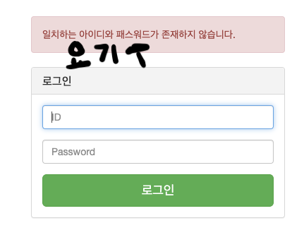
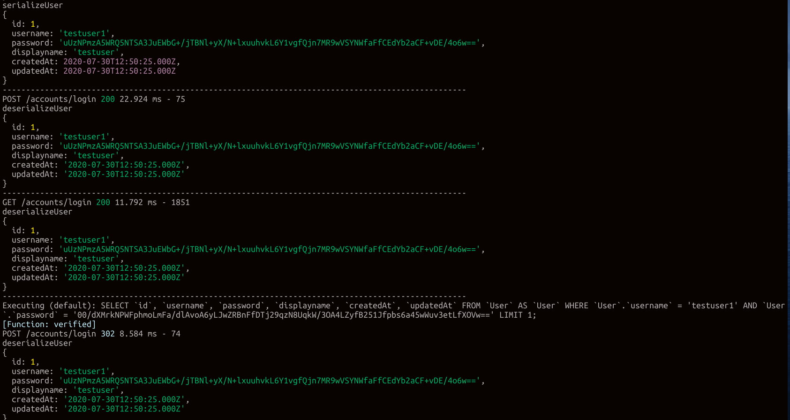

week2-2

===

### multer

`npm install multer`

- [multer github](https://github.com/expressjs/multer/blob/master/doc/README-ko.md)
- multer은 body에서 한개이상의 파일을 받아올 수 있습니다. 한개(request.file), 한개이상(request.files)로 나눌 수 있습니다.
- multipart/form-data를 바탕으로 개발되었습니다. form태그 속성으로 `<form enctype="multipart/form-data"></form>` 넣어주어야 사용할 수 있습니다.
- 현재는 하나의 서버에서 이미지 작업을 진행하지만 이미지 서버를 따로 두는것이 좋습니다.

  - 이유
  - 기능을 분리하여 서버 부하를 방지합니다.
  - 물리적으로 분리하여 보안을 강화합니다.
  - 여러대의 was와 연결이 가능합니다.
  - 확장성이 좋습니다.

- 현재는 multer를 이용하여 로컬에 이미지를 저장하지만 추후 multer s3를 이용하여 해당 AWS에 이미지 업로드합니다.

  - S3는 HTTP 프로토콜로 파일 업로드,다운로드가 가능합니다.
  - 로컬에 저장되어진 이미지들은 클라이언트 페이지에서 볼 수 없기 때문입니다.
  - URL을 통해서만 이미지,미디어 파일에 접근 할 수 있기 때문입니다.

- 현재는 DB에 필드를 추가하고, 테이블을 삭제후 생성하여 파일을 업로드하는 방식으로 진행합니다.

```js
//app.js
db.sequelize
  .authenticate()
  .then(() => {
    console.log('Connection has been established successfully.');
    // return db.sequelize.drop(); << 이부분을 실행후 sync를 진행합니다.
    return db.sequelize.sync();
  })
  .then(() => {
    console.log('DB Sync complete.');
  })
  .catch((err) => {
    console.error('Unable to connect to the database:', err);
  });
```

- 정상적인 방법은 sequelize migration을 이용하여 삭세 생성이 아니라 권한을 부여합니다.
  - sequelize migration
  - 운영중인 서비스에서 데이터 베이스 변경할때 용이합니다.
  - drop,sync를 연결해줄 경우 운영중인 서비스에서는 갱신이 안됩니다.
  - 스키마를 직접 수정하여 제공하는 서비스가 있지만, sequelize 모델링 코드를 변경하는 것은 번거롭고, 해당 작업을 실수할경우 되돌리기가 힘들기 때문에 권한을 부여해줍니다.

---

- static 폴더 : 별도의 라우터 경로없이 고정적으로 접근을 하기 위하여 사용합니다.
  `app.use('/routes', express.static('dir'));`

  ```js
  //app.js
  app.use('/uploads', express.static('uploads'));
  ```

- router의 경로마다 사용하는 이미지가 다른것이 아니라 이미지를 고정적으로 이용할 수 있습니다. 해당 이미지를 이용하기 위해서 고정적인 경로를 지정하여 해당 경로에 접근 할 수 있게 해주기 위해서 사용합니다.
- 해당경로를 지정해주지 않으면 경로마다 다른 경로를 설정해야하는 번거로움도 있고 해당 경로를 추적하는 도중에 직관성및 가독성이 떨어지기 떄문에 정적으로 이미지 폴더를 지정합니다.

---

- 저장되어질 폴더의 경로를 지정해줍니다.

```js
const uploadDir = path.join(__dirname, '../uploads'); // 루트의 uploads위치에 저장한다.
```

- middleware를 이용하여 file에 이미지가 올라오면 해당 파일의 설정값을 지정해줍니다.
- destination : 폴더의 저장경로
- filename :파일의 이름변경
  - 이름변경이유 : 동일이름의 파일이 들어올경우 이름을 일일히 변경하기 힘들기 때문에 미리 고정적인 방식으로 변경합니다.
- form에서 데이터가 전송되면 tmp파일에서 임시 저장한 후 해당 경로로 저장이 진행됩니다.

```js
//middleware
const stroage = multer.diskStorage({
  destination: (req, file, callback) => {
    callback(null, uploadDir);
  },
  filename: (req, file, callback) => {
    callback(null, `products~${Date.now()}.${file.mimetype.split('/')[1]}`);
  },
});
// multer storage 파일 설정 지정.
const upload = multer({ storage: stroage });
```

결과값.

```
+----+------+----------------------------+--------+-------------+---------------------+---------------------+
| id | name | thumbnail                  | price  | description | createdAt           | updatedAt           |
+----+------+----------------------------+--------+-------------+---------------------+---------------------+
|  1 | test | products~1596110137757.png | 123123 | tset        | 2020-07-30 20:55:37 | 2020-07-30 21:21:32 |
+----+------+----------------------------+--------+-------------+---------------------+---------------------+
```

---

- router에 middleware추가

- mimetype : image만 업로드를 지정해주기 위해서 사용합니다. req.file.mimetype으로 접근하여 이미지 파일만 업로드 할 수 있기 때문입니다.
  - javascript를 업로드하여 해킹 및 정보를 가로챌 수 있기 때문에 사전에 방지하기위하여 사용합니다.
- html 태그에서도 설정이 가능합니다. `<input type="file" name="thumbnail" accept="image/*" />`

```js
router.post(
  'router 경로',
  upload.single('thumbnail'), // input의 필드명을 thumbnail로 한다.
  //파일이 2개 이상일경우 array로 변경한 후 사용할 수 있습니다.
  csrfProtection,
  async (req, res) => {
    const data = req.body;
    data.thumbnail = req.file ? req.file.filename : '';
    console.log(req.file);
    // 파일이 오면 저장하고 아니면 저장하지 않는다는것을 추가시켜 줍니다.
    await models.Products.create(data);
    res.redirect('재설정 경로');
  },
);
```

```
//image를 업로드 할 경우
file: {
    fieldname: 'thumbnail',
    originalname: '스크린샷.png',
    encoding: '7bit',
    mimetype: 'image/png',
    destination: '/Users/joonwoojeong/fc-source/source/uploads',
    filename: 'products~1596161578479.png',
    path: '/Users/joonwoojeong/fc-source/source/uploads/products~1596161578479.png',
    size: 1421726
}
-------------------------------------------------------------------------------------------
//image가 없을 경우
undefined
undefined
```

DB에 저장되어질때.

```
+----+-------------+----------------------------+--------+-----------------------+---------------------+---------------------+
| id | name        | thumbnail                  | price  | description           | createdAt           | updatedAt           |
+----+-------------+----------------------------+--------+-----------------------+---------------------+---------------------+
|  5 | imageTest   | products~1596162341666.png |   1000 | imageTest 입니다.     | 2020-07-31 11:25:41 | 2020-07-31 11:25:41 |
|  6 | noImageTest |                            |   1000 | noImageTest입니다.    | 2020-07-31 11:26:27 | 2020-07-31 11:26:27 |
+----+-------------+----------------------------+--------+-----------------------+---------------------+---------------------+
```

---

### 회원가입

- 회원관련 라우터를 새로 생성합니다.

```js
//app.js
app.use('/accounts', accounts);
```

- 비밀번호를 암호화 해주어야 합니다.
  - 암호화를 해주기 위하여 해당 정보가 들어오면 hooking하여 데이터를 가공하여 넣어주기 위해서 사용합니다.

```js
//sequelize Table함수
const 암호화함수 = require('모듈경로');

DB테이블변수명.beforeCreate((user, _) => {
  //sequlizer hook //middle ware이지만 hooking을 하는 동작입니다. react hook이랑은 다릅니다.
  console.log(user);
  user.password = passwordHash(user.password); //비밀번호는 훅을 걸어서 비밀번호 저장 전에 암호화 하고 진행을 한다.
});
```

테이블에 새로운 값을 넣어줍니다.

```js
router.post('/라우터경로', async (req, res) => {
  try {
    await models.테이블.create(req.body);
    res.send(
      '<script>alert("회원가입 성공");location.href="/accounts/login";</script>',
    );
  } catch (e) {
    console.log(e);
  }
});
```

DB에서 저장되어질 값

```
dataValues: {
    id: null,
    username: 'testuser1',
    password: '1234',
    displayname: 'testuser입니다',
    updatedAt: 2020-07-31T02:47:59.351Z,
    createdAt: 2020-07-31T02:47:59.351Z
  }
```

- crypto모듈을 이용하여 암호화
  - [crypto Document](https://nodejs.org/api/crypto.html)
  - 암호화 작업을 위해 사용됩니다.
  - 단방향 암호화로 처리 되기 때문에 해당 값을
  - 해킹을 당했을때 암호화 하더라도 데이터를 수집하였을때 해당 패턴을 파악하여 찾을 수 있기 때문에 salt값을 넣어주어 해당 값을 파악하는데 시간이 걸리게 합니다. 해킹 하여도 찾거나 방지 할 수 없기때문에 해킹방지용은 아닙니다.
    - salt : 단방향암호화에서 패스워드에 값을 추가하여 해시데이터를 복호화 하기 힘들게 해주는 데이터입니다.

```js
//passwordHash.js
const crypto = require('crypto');
const salt = '암호에 추가할 단어'; //임의로 설정

module.exports = (password) => {
  return crypto //crypto 모듈을 이용하여 생성된 값을 반환합니다.
    .createHash('sha512') //sha512,118,md5(php에서부터 있어서 보안이약함)
    .update(password + salt) // password와 salt값을 합해서 처리합니다.
    .digest('base64'); // diget('base64') 64개의 문자 안에서 조합해서 사용한다.
};
```

//모듈을 사용한 결과

```
Executing (default): INSERT INTO `User` (`id`,`username`,`password`,`displayname`,`createdAt`,`updatedAt`)
VALUES (DEFAULT,'testuser1','uUzNPmzA5WRQ5NTSA3JuEWbG+/jTBNl+yX/N+lxuuhvkL6Y1vgfQjn7MR9wVSYNWfaFfCEdYb2aCF+vDE/4o6w==','testuser입니다','2020-07-31 11:47:59','2020-07-31 11:47:59');
```

```
database
+----+-----------+------------------------------------------------------------------------------------------+-------------------+---------------------+---------------------+
| id | username  | password                                                                                 | displayname       | createdAt           | updatedAt           |
+----+-----------+------------------------------------------------------------------------------------------+-------------------+---------------------+---------------------+
|  1 | testuser1 | uUzNPmzA5WRQ5NTSA3JuEWbG+/jTBNl+yX/N+lxuuhvkL6Y1vgfQjn7MR9wVSYNWfaFfCEdYb2aCF+vDE/4o6w== | testuser          | 2020-07-30 21:50:25 | 2020-07-30 21:50:25 |
|  2 | testuser2 | uUzNPmzA5WRQ5NTSA3JuEWbG+/jTBNl+yX/N+lxuuhvkL6Y1vgfQjn7MR9wVSYNWfaFfCEdYb2aCF+vDE/4o6w== | testuser          | 2020-07-30 21:51:17 | 2020-07-30 21:51:17 |
|  3 | testuser1 | uUzNPmzA5WRQ5NTSA3JuEWbG+/jTBNl+yX/N+lxuuhvkL6Y1vgfQjn7MR9wVSYNWfaFfCEdYb2aCF+vDE/4o6w== | testuser입니다    | 2020-07-31 11:47:59 | 2020-07-31 11:47:59 |
+----+-----------+------------------------------------------------------------------------------------------+-------------------+---------------------+---------------------+
```

### 로그인

`npm install passport passport-local connect-flash express-session`

- express-session
  - 세션데이터는 쿠키에 스스로 저장하지 않고 session id로만 저장됩니다. 세션 데이터는 서버 한쪽에 저장되어집니다.
  - 1.5.0버전부터는 쿠키를 바로 읽고 쓸수 있게 변경되어서 cookie-parser 미들웨어가 필요하지 않습니다.
  - option
    - secret : 해당 값을 이용하여 암호화 하여 세션에 저장합니다.
    - resave : 세션을 언제나 저장할지에 대해서 지정합니다.
    - saveUninitalized : 세션이 저장되기전에 uninitalized상태로 만들어서 저장합니다.
    - maxAge : session의 저장시간을 지정합니다.
- passport
  - 인증절차를 로직으로 작성하여 편리하게 해줍니다.
- passport-local
  - username/password를 이용하여 쿠키-세션으로 인증하게 해주는 passport strategy입니다.
  - strategy전략을 의미합니다. 즉, 해당 인증방법을 서술하는 방식입니다. 서술하여 그 방식대로 값을 사용합니다.
  - 이외에도 여러가지 있습니다. passport-github,passport-jwt(JsonWebToken)
- connect-flash

  - flash message를 사용하기 위하여 사용합니다.
  - flash message는 화면에 뜨지만 이벤트나 동작시 사라지는 메세지를 의미합니다.
    

- 서버 스크립트에 passport,session,flash를 선언해줍니다.

```js
//app.js
const passport = require('passport');
const session = require('express-session');
const flash = require('connect-flash');

//session 관련 셋팅
app.use(
  session({
    secret: 'fastcampus', //fastcampus를 암호화하여 저장합니다.
    resave: false, //해당값을 언제나 저장하지 않습니다.
    saveUninitialized: true, // uninitalized 상태로 만듭니다.
    cookie: {
      maxAge: 2000 * 60 * 60, //지속시간 2시간
    },
  }),
);

//passport 적용
app.use(passport.initialize());
app.use(passport.session());

//플래시 메시지 관련
app.use(flash());
```

- passport 설정하기

  - localStrategy option

    - usernameField: 사용한 id값을 입력합니다.
    - passwordField: 사용한 비밀번호 값을 입력합니다.
    - passReqToCallback: 아래에 `(id, password, done) => {};` => `(req, id, password, done) => {};`로 request가 추가되어 session에 접근할 수 있게 해줍니다.

```js
const passport = require('passport');
const LocalStrategy = require('passport-local').Strategy;

passport.serializeUser((user, done) => {
  console.log('serializeUser');
  console.log(user);
  console.log(
    '---------------------------------------------------------------------------------------------------',
  );
  done(null, user);
});

passport.deserializeUser((user, done) => {
  console.log('deserializeUser');
  console.log(user);
  console.log(
    '---------------------------------------------------------------------------------------------------',
  );
  done(null, user);
});

passport.use(
  new LocalStrategy(
    {
      usernameField: 'username',
      passwordField: 'password',
      //username이 testuser1,password가 hello로 도착시
      //아래 부분에서 username : testuser1,password:hello로 이용이 가능합니다.
      passReqToCallback: true,
    },
    async (req, username, password, done) => {
      const user = await models.User.findOne({
        //DB에 접근하여 해당 값을 조회합니다.
        where: {
          username,
          password: passwordHash(password),
        },
        // attributes : { exclude : ['password']};  password값을 제외하고 진행한다.
      });
      console.log(done);
      if (!user) {
        return done(null, false, {
          message: '일치하는 아이디와 패스워드가 존재하지 않습니다.', //flashmessage를 전송합니다.
        });
      } else {
        console.log(user.dataValues);
        return done(null, user.dataValues);
      }
    },
  ),
);
```



- serializeUser
  - 최초의 로그인시 작동됩니다.
- deserializeUser
  - 유저가 페이지를 이동할때 사용됩니다.
  - socketIO에서는 접근이 불가능합니다.
